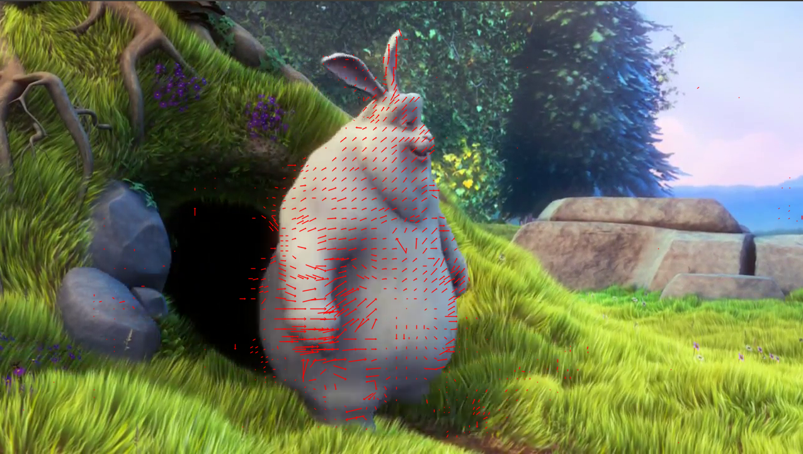

# Motion Vector Extractor

This tool extracts frames, motion vectors, frame types and timestamps from H.264 and MPEG-4 Part 2 encoded videos.

This class is a replacement for OpenCV's [VideoCapture](https://docs.opencv.org/4.1.0/d8/dfe/classcv_1_1VideoCapture.html) and can be used to read and decode video frames from a H.264 or MPEG-4 Part 2 encoded video stream/file. It returns the following values for each frame:
- decoded frame as BGR image
- motion vectors
- Frame type (keyframe, P- or B-frame)
- (for RTSP streams): UTC wall time of the moment the sender sent out a frame (as opposed to an easily retrievable timestamp for the frame reception)

These additional features enable further projects, such as fast visual object tracking or synchronization of multiple RTSP streams. Both a C++ and a Python API is provided. Under the hood [FFMPEG](https://github.com/FFmpeg/FFmpeg) is used.

The image below shows a video frame with extracted motion vectors overlaid,



A usage example can be found in `test.py`.


## Installation

### Step 1: Install Prerequisites

Install [Docker](https://docs.docker.com/).

### Step 2: Clone Source Code

Change into the desired installation directory on your machine and clone the source code
```
git clone https://github.com/LukasBommes/mv-extractor.git mv_extractor
```

### Step 3: Pull and Run Docker Image

Change into the `mv_extractor` directory and run the prebuilt Docker image
```
sudo docker run -it --ipc=host --env="DISPLAY" -v $(pwd):/home/video_cap -v /tmp/.X11-unix:/tmp/.X11-unix:rw lubo1994/mv-extractor:latest /bin/bash
```

<details>
  <summary>Alternative: Build Docker image locally</summary>
  
This step is not required and for faster installation, we recommend using the prebuilt image. 
If you still want to build the Docker image locally, you can do so by running the following command in the `mv_extractor` directory
```
sudo docker build . --tag=mv_extractor
```
Note that building can take more than one hour.

Now, run the docker container with
```
sudo docker run -it --ipc=host --env="DISPLAY" -v $(pwd):/home/video_cap -v /tmp/.X11-unix:/tmp/.X11-unix:rw mv_extractor /bin/bash
```

Building the image leaves some intermediate images behind which can be deleted via
```
sudo docker rmi -f $(sudo docker images -f "dangling=true" -q)
```
</details>


### Step 4: Test Installation

Test if everything is installed succesfully by running the demo script
```
python3 test.py
```
If you encounter the error message "cannot open display: :1" or similar, you have to disable the X server access control by running
```
xhost +
```
in a new terminal on the host machine (not inside the Docker container).


## Usage

If you want to use the motion vector extractor in your own Python script import it via
```
from mv_extractor import VideoCap
```
You can then use it according to the example in `test.py`.

Generally, a video file is opened by `VideoCap.open()` and frames, motion vectors, frame types and timestamps are read by calling `VideoCap.read()` repeatedly. Before exiting the program, the video file has to be closed by `VideoCap.release()`. For a more detailed explanation see the API documentation below.


## Python API

This module provides a Python API which is very similar to that of OpenCV [VideoCapture](https://docs.opencv.org/4.1.0/d8/dfe/classcv_1_1VideoCapture.html). Using the Python API is the recommended way of using the H.264 Motion Vector Capture class.

#### Class :: VideoCap()

| Methods | Description |
| --- | --- |
| VideoCap() | Constructor |
| open() | Open a video file or url |
| grab() | Reads the next video frame and motion vectors from the stream |
| retrieve() | Decodes and returns the grabbed frame and motion vectors |
| read() | Convenience function which combines a call of grab() and retrieve(). |
| release() | Close a video file or url and release all ressources |

##### Method :: VideoCap()

Constructor. Takes no input arguments.

##### Method :: open()

Open a video file or url. The stream must be H264 encoded. Otherwise, undesired behaviour is likely.

| Parameter | Type | Description |
| --- | --- | --- |
| url | string | Relative or fully specified file path or an url specifying the location of the video stream. Example "vid.flv" for a video file located in the same directory as the source files. Or "rtsp://xxx.xxx.xxx.xxx:554" for an IP camera streaming via RTSP. |

| Returns | Type | Description |
| --- | --- | --- |
| success | bool | True if video file or url could be opened successfully, false otherwise. |

##### Method :: grab()

Reads the next video frame and motion vectors from the stream, but does not yet decode it. Thus, grab() is fast. A subsequent call to retrieve() is needed to decode and return the frame and motion vectors. the purpose of splitting up grab() and retrieve() is to provide a means to capture frames in multi-camera scenarios which are as close in time as possible. To do so, first call grab() on all cameras and afterwards call retrieve() on all cameras.

Takes no input arguments.

| Returns | Type | Description |
| --- | --- | --- |
| success | bool | True if next frame and motion vectors could be grabbed successfully, false otherwise. |

##### Method :: retrieve()

Decodes and returns the grabbed frame and motion vectors. Prior to calling retrieve() on a stream, grab() needs to have been called and returned successfully.

Takes no input arguments and returns a tuple with the elements described in the table below.

| Index | Name | Type | Description |
| --- | --- | --- | --- |
| 0 | success | bool | True in case the frame and motion vectors could be retrieved sucessfully, false otherwise or in case the end of stream is reached. When false, the other tuple elements are set to empty numpy arrays or 0. |
| 1 | frame | numpy array | Array of dtype uint8 shape (h, w, 3) containing the decoded video frame. w and h are the width and height of this frame in pixels. Channels are in BGR order. If no frame could be decoded an empty numpy ndarray of shape (0, 0, 3) and dtype uint8 is returned. |
| 2 | motion vectors | numpy array | Array of dtype int64 and shape (N, 10) containing the N motion vectors of the frame. Each row of the array corresponds to one motion vector. If no motion vectors are present in a frame, e.g. if the frame is an `I` frame an empty numpy array of shape (0, 10) and dtype int64 is returned. The columns of each vector have the following meaning (also refer to [AVMotionVector](https://ffmpeg.org/doxygen/4.1/structAVMotionVector.html) in FFMPEG documentation): <br>- 0: source: Offset of the reference frame from the current frame. The reference frame is the frame where the motion vector points to and where the corresponding macroblock comes from. If source < 0, the reference frame is in the past. For s > 0 the it is in the future (in display order).<br>- 3: src_x: x-location (in pixels) where the motion vector points to in the reference frame.<br>- 4: src_y: y-location (in pixels) where the motion vector points to in the reference frame.<br>- 5: dst_x: x-location of the vector's origin in the current frame (in pixels). Corresponds to the x-center coordinate of the correspdoning macroblock.<br>- 6: dst_y: y-location of the vector's origin in the current frame (in pixels). Corresponds to the y-center coordinate of the correspdoning macroblock.<br>- 7: motion_x = motion_scale * (src_x - dst_x)<br>- 8: motion_y = motion_scale * (src_y - dst_y)<br>- 9: motion_scale: see definiton of columns 7 and 8. Used to scale up the motion components to integer values. E.g. if motion_scale = 4, motion components can be integer values but encode a float with 1/4 pixel precision. |
| 3 | frame_type | string | Unicode string representing the type of frame. Can be `"I"` for a keyframe, `"P"` for a frame with references to only past frames and `"B"` for a frame with references to both past and future frames. A `"?"` string indicates an unknown frame type. |
| 4 | timestamp | double | UTC wall time of each frame in the format of a UNIX timestamp. In case, input is a video file, the timestamp is derived from the system time. If the input is an RTSP stream the timestamp marks the time the frame was send out by the sender (e.g. IP camera). Thus, the timestamp represents the wall time at which the frame was taken rather then the time at which the frame was received. This allows e.g. for accurate synchronization of multiple RTSP streams. In order for this to work, the RTSP sender needs to generate RTCP sender reports which contain a mapping from wall time to stream time. Not all RTSP senders will send sender reports as it is not part of the standard. If IP cameras are used which implement the ONVIF standard, sender reports are always sent and thus timestamps can always be computed. |

##### Method :: read()

Convenience function which internally calls first grab() and then retrieve(). It takes no arguments and returns the same values as retrieve().

##### Method :: release()

Close a video file or url and release all ressources. Takes no input arguments and returns nothing.


## C++ API

The C++ API differs from the Python API in what parameters the methods expect and what values they return. Refer to the docstrings in `src/video_cap.hpp`.


## Theory

What follows is a short explanation of the data returned by the `VideoCap` class. Also refer this [excellent book](https://dl.acm.org/citation.cfm?id=1942939) by Iain E. Richardson for more details.

##### Frame
The decoded video frame. Nothing special about that.

##### Motion Vectors

H.264 uses different techniques to reduce the size of a raw video frame prior to sending it over a network or storing it into a file. One of those techniques is motion estimation and prediction of future frames based on previous or future frames. Each frame is split into 16 pixel x 16 pixel large macroblocks. During encoding motion estimation matches every macroblock to a similar looking macroblock in a previously encoded frame (note that this frame can also be a future frame since encoding and playout order might differ). This allows to transmit only those motion vectors and the reference macroblock instead of all macroblocks, effectively reducing the amount of transmitted or stored data. <br>
Motion vectors correlate directly with motion in the video scene and are useful for various computer vision tasks, such as visual object tracking.

##### Frame Types

The frame type is either "P", "B" or "I" and refers to the H.264 encoding mode of the current frame. An "I" frame is send fully over the network and serves as a reference for "P" and "B" frames for which only differences to previously decoded frames are transmitted. Those differences are encoded via motion vectors. As a consequence for an "I" frame no motion vectors are returned by this library. The difference between "P" and "B" frames is that "P" frames refer only to pas frames, whereas "B" frames have motion vectors which refer to both past and future frames. References to future frames are possible even with live streams because the decoding order of frames differs from the display order.

##### Timestamps

In addition to extracting motion vectors and frame types, the video capture class also outputs a UNIX timestamp representing UTC wall time for each frame. If the stream originates from a video file, this timestamp is simply derived from the current system time. However, when an RTSP stream is used as input, the timestamp calculation is more intricate as the timestamps represents not the time when the frame was received, but the time when the frame was send by the sender. Thus, this timestamp can be used for accurate synchronization of multiple video streams.

Computation of the frame wall time works as follows:

1. Wait for a RTCP sender report package which contains a mapping between the stream's RTP timestamp and the current UTC wall time. Now, a correlation between RTP timestamps of the stream and wall time is known. Name the RTP timestamp `T_RTP_LAST` and the corresponding UTC wall time `T_UTC_LAST`.

2. For each new frame, compute the UTC timestamp as follows:<br>
```
T_UTC = T_UTC_LAST + (T_RTP - T_RTP_LAST) / 90000
```
Here `T_RTP` is the frame's RTP timestamp and `T_RTP_LAST` and `T_UTC_LAST` are the RTP timestamp and corresponding UTC wall time of the last RTCP sender report packet. The factor of 90000 is needd because the RTP timestamps increment with 90 kHz per RTSP specification. That means, that the RTP timestamp increments by 90000 every second.

Note, that the sender clock needs to be synchronized with a network time server (via NTP) to ensure frame timestamps are in sync with UTC. Most IP cameras provide an option for this.


## About

This software is written by **Lukas Bommes, M.Sc.** - [A*Star SIMTech, Singapore](https://www.a-star.edu.sg/simtech)<br>
It is based on [MV-Tractus](https://github.com/jishnujayakumar/MV-Tractus/tree/master/include) and OpenCV's [videoio module](https://github.com/opencv/opencv/tree/master/modules/videoio).


#### License

This project is licensed under the MIT License - see the [LICENSE](LICENSE) file for details.


#### Citation

If you use our work for academic research please cite

```
@INPROCEEDINGS{9248145,
  author={L. {Bommes} and X. {Lin} and J. {Zhou}},
  booktitle={2020 15th IEEE Conference on Industrial Electronics and Applications (ICIEA)}, 
  title={MVmed: Fast Multi-Object Tracking in the Compressed Domain}, 
  year={2020},
  volume={},
  number={},
  pages={1419-1424},
  doi={10.1109/ICIEA48937.2020.9248145}}
```
